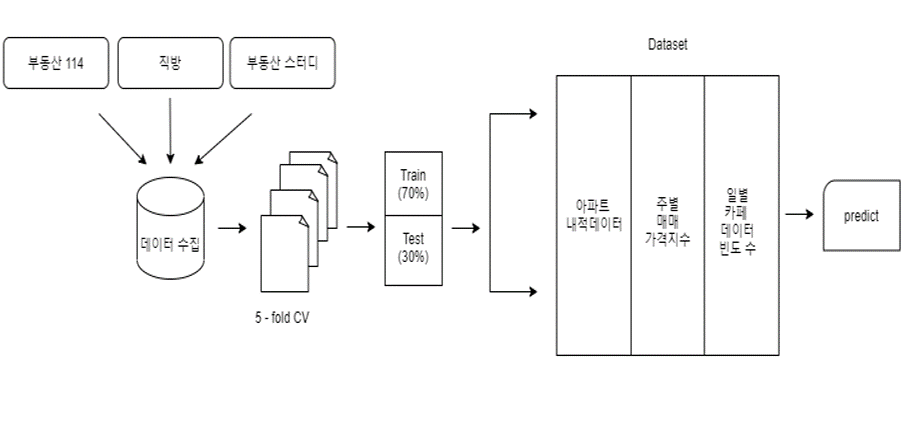

# Apartment Property Price Prediction (기계학습을 이용한 아파트 매매가격 예측 연구 : 한국 아파트의 내·외적 데이터 수집과 가격 예측 중심으로)

## Abstract

본 연구에서는 아파트를 대표할 수 있는 내·외적 데이터를 수집하고 인공지능 기술들을 활용하여 아파트 가격을 예측하는 시스템을 구축하고자 한다. 2012년 1월부터 2020년 8월까지의 아파트 데이터를 수집하였으며 내적데이터란 아파트의 고유 데이터로 평수, 건축 년도, 학교까지의 거리, 역까지의 거리, 시공사 등 변하지 않는 데이터를 의미한다. 외적데이터란 변하는 데이터로 선호도를 의미하며 네이버카페 ‘부동산 스터디’에서 일 년 동안의 언급회수를 의미한다. 같은 조건의 아파트라 할지라도 사람들의 선호도는 다를 수 있다. 이를 반영하기 위해 본 연구에서는 기존연구들과 차별적으로 외적 데이터를 수집하여 기계학습에 이용하였다. 구체적으로 웹 크롤링 기법을 통해 수집한 아파트 내·외적 데이터의 변수들에 대한 특성 선택(Feature Selection)을 수행하였고, 다양한 인공지능 기법을 활용하여 부동산 가격 예측 모형을 개발하였다. 아파트 가격 예측 모형 생성을 위해 Linear Regression, Ridge, Xgboost, Lightgbm, Catboost 등의 기계학습 알고리즘을 사용하였고, RMSE를 사용하여 각 예측 모형 간의 성능 비교를 수행하였다. 외적데이터의 영향력을 비교하기 위해 아파트 선호도 변수를 추가했을 때와 추가하지 않았을 때의 성능을 비교했다. 가장 성능이 좋은 예측 모형은 외적데이터를 추가했을 때의 Xgboost기반 예측 모형이었으며, RMSE값이 약 0.0366으로 가장 낮았고 테스트 데이터에 대한 정확도는 약 95.1%였다.

keywords: 서울시 아파트, 가격 예측, 내·외적 데이터, 기계학습

## Requirements

python==3.x

pandas

numpy

matplot

seaborn

lightgbm

sklearn

xboost

catboost

selenium

pyperclip

tensorflow==1.14

## Data

| 변수명    | 타입  | 설명                      | 데이터 종류 | 출처                       |
| --------- | ----- | ------------------------- | ----------- | -------------------------- |
| 전용면적  | FLOAT | 아파트 면적               | 내적 데이터 | 국토교퉁부                 |
| 거래금액  | INT   | 아파트 매매가격           | 내적 데이터 | 국토교퉁부                 |
| 층        | INT   | 거래된 아파트의 층        | 내적 데이터 | 국토교퉁부                 |
| 건축 년도 | INT   | 아파트 건축 년도          | 내적 데이터 | 부동산    웹사이트         |
| 동수      | INT   | 아파트 단지의 동 수       | 내적 데이터 | 부동산    웹사이트         |
| 역        | INT   | 역까지 거리 및 도보시간   | 내적 데이터 | 부동산    웹사이트         |
| 학군      | INT   | 학교까지 거리 및 도보시간 | 내적 데이터 | 부동산    웹사이트         |
| 총 층수   | INT   | 아파트의 가장 높은 층     | 내적 데이터 | 부동산    웹사이트         |
| 시공사    | STR   | 아파트 시공사             | 내적 데이터 | 부동산    웹사이트         |
| 선호도    | INT   | 아파트 언급 회수          | 외적 데이터 | 네이버 카페 ‘부동산스터디’ |

## Results

기계학습 모형의 RMSE 값

| Model             | RMSE         |
| ----------------- | ------------ |
| Linear regression | 0.059185     |
| Lasso regression  | 0.059689     |
| Xgboost           | **0.036559** |
| Lightgbm          | 0.083192     |
| Catboost          | 0.038034     |

외적데이터를 제외한 기계학습 모형의 RMSE 값

| Model             | RMSE         |
| ----------------- | ------------ |
| Linear regression | 0.061976     |
| Lasso regression  | 0.062374     |
| Xgboost           | **0.037870** |
| Lightgbm          | 0.946643     |
| Catboost          | 0.085559     |

전체적으로 비교했을 때, 외적데이터인 아파트 선호도를 사용했을 때의 기계학습 모형이 선호도를 사용하지 않은 모형보다 성능이 뛰어났다. 5개의 예측 알고리즘 중 RMSE 값을 비교한 결과, 0.0305로 성능이 가장 좋은 Xgboost를 최종 모델로 선정하여 유의미한 예측 결과를 도출하였다. Xgboost의 테스트 데이터에 대한 정확도는 0.950796이다.

